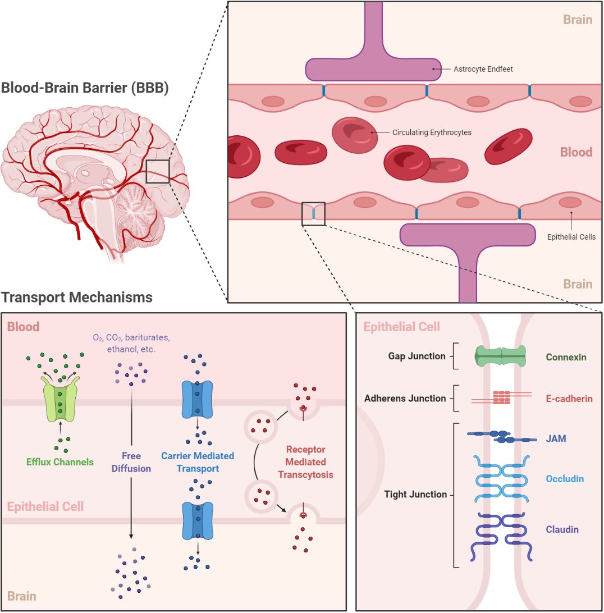

# Investigating molecular blood-brain-barrier permeability

**Lab Final Project**
**PHYSCI 2 at Harvard College**
**Ayush Noori, Aditi Raju, Jared Ni**

## Introduction

The blood-brain-barrier (BBB) is a selective semipermeable membrane that separates circulating blood from the brain and extracellular fluid in the central nervous system, and is responsible for regulation of CNS homeostasis and protection of the brain microenvironment from toxins, pathogens, and other threats (Daneman & Prat, 2015; Obermeier et al., 2013). At every level of the neurovascular tree, endothelial cells of the BBB line the capillaries and are surrounded by pericytes, astrocytes, microglia, extracellular matrix components, and peripheral immune cells, which together form the neurovascular unit (Iadecola, 2017). The physical properties of the neurovascular unit -- most importantly, the continuous tight junctions which connect the non-fenestrated endothelial cells -- restrict the paracelllular and transcellular movememnt of molecules from the bloodstream into the brain (Figure 1) (Abbott et al., 2010; Langen et al., 2019). Other key features of the BBB which govern passage into the brain include specific molecular transporters which facilitate both the influx of nutrients and the efflux of toxins; catalytic enzymes such as intracellular monoamine oxidase and cytochrome P450 which degrade potential toxins; and extravascular structures such as endothelial glycoalyx and astrocytic endfeet which modulate BBB function (Abbott et al., 2006; Daneman & Prat, 2015; Langen et al., 2019).



**Figure 1: Transport regulatory functions of the blood-brain barrier.** Figure from [ayushnoori/graph-bbb](https://github.com/ayushnoori/graph-bbb) on GitHub and created using Biorender.com.

In addition to regulating the passage of nutrients into the brain and protecting the brain microenvironment from invaders or pathogens, the BBB also prevents more than 98% of small molecule drugs and macromolecular therapeutics from reaching the brain. This poses a major obstacle in the treatment of neurological disorders which often remain refractory to treatment due to the inability of drugs to cross the BBB (Wu et al., 2023). The BBB is therefore a major target of drug delivery research, and understanding the permeability of molecules to the BBB is of great interest to facilitate the development of new neurotherapeutics. Our own previous work has attempted to predict BBB permeability (for example, see [ayushnoori/graph-bbb](https://github.com/ayushnoori/graph-bbb) on GitHub), but this has been limited by lack of molecular diversity and interpretability. In this project, we aim to investigate the relationship between molecular structure and BBB permeability using a structurally diverse dataset of 1058 compounds with known BBB permeabilities. 

## Research Question

Here, we investigate the relationships between BBB permeability and molecular properties such as molecular weight, number of hydrogen bond donors and acceptors, number of rotatable bonds, and number of rings. 

## Methodology and Results

We use techniques learned during the Fall 2023 semester in PHYSCI 2 Lab at Harvard College to investigate the relationships between molecular properties of interest and BBB permeability. We leverage a new diverse molecular database of BBB permeability with chemical descriptors, recently published in *Nature Scientific Data* in 2021:

Meng, F., Xi, Y., Huang, J. & Ayers, P. W. [A curated diverse molecular database of blood-brain barrier permeability with chemical descriptors.](https://www.nature.com/articles/s41597-021-01069-5) *Sci Data* **8**, 289 (2021).

Please also see [theochem/B3DB](https://github.com/theochem/B3DB) and [Issue #174 of mims-harvard/TDC](https://github.com/mims-harvard/TDC/issues/174) on GitHub. After retrieving and pre-processing our data, we calculate several molecular features of 1058 compounds as well as numerical logBB values for each compound, where logBB is the logarithm of the brain-plasma concentration ratio:
$$\log{BB} = \log{\frac{C_{brain}}{C_{blood}}}$$

Then, we apply curve fitting methods learned in Lab 4 and Lab 5 to fit various biologically-informed models to the data. We visualize our data and results and, based on visual inspection, generate hypotheses for relationships between molecular features and logBB. Finally, we use $\chi^2_{red}$-testing to select from multiple competing models of the data and compare the goodness-of-fit of each. 

**Our experimental design, methodology, and results are described in detail in `final_project.ipynb`.**

## Installation

To install the code, please clone this repository with the following:

```bash
git clone git@github.com:ayushnoori/ps2-lab.git
cd ps2-lab
```

Create a virtual environment.

```
conda deactivate
pip install virtualenv
virtualenv lab_env
source lab_env/bin/activate
```

Install necessary packages specified in `requirements.txt`.

```bash
pip install -r requirements.txt
```

To save the specific versions of each package required, run the following:

```bash
pip freeze > requirements-frozen.txt
```

Activate the `lab_env` virtual environment with the following:

```
source setup.sh
```
If desired, a Jupyter server can be created with the following:

```
source setup_jupyter.sh
```

## References

1. Abbott, N. J., Patabendige, A. A. K., Dolman, D. E. M., Yusof, S. R. & Begley, D. J. Structure and function of the blood–brain barrier. *Neurobiology of Disease* **37**, 13–25 (2010).

2. Abbott, N. J., Rönnbäck, L. & Hansson, E. Astrocyte–endothelial interactions at the blood–brain barrier. *Nat Rev Neurosci* **7**, 41–53 (2006).

3. Daneman, R. & Prat, A. The Blood–Brain Barrier. *Cold Spring Harb Perspect Biol* **7**, a020412 (2015).

4. Iadecola, C. The neurovascular unit coming of age: a journey through neurovascular coupling in health and disease. *Neuron* **96**, 17–42 (2017).

5. Langen, U. H., Ayloo, S. & Gu, C. Development and Cell Biology of the Blood-Brain Barrier. *Annual Review of Cell and Developmental Biology* **35**, 591–613 (2019).

6. Meng, F., Xi, Y., Huang, J. & Ayers, P. W. A curated diverse molecular database of blood-brain barrier permeability with chemical descriptors. *Sci Data* **8**, 289 (2021).

6. Obermeier, B., Daneman, R. & Ransohoff, R. M. Development, maintenance and disruption of the blood-brain barrier. *Nat Med* **19**, 1584–1596 (2013).

7. Wu, D. et al. The blood–brain barrier: structure, regulation, and drug delivery. *Sig Transduct Target Ther* **8**, 1–27 (2023).